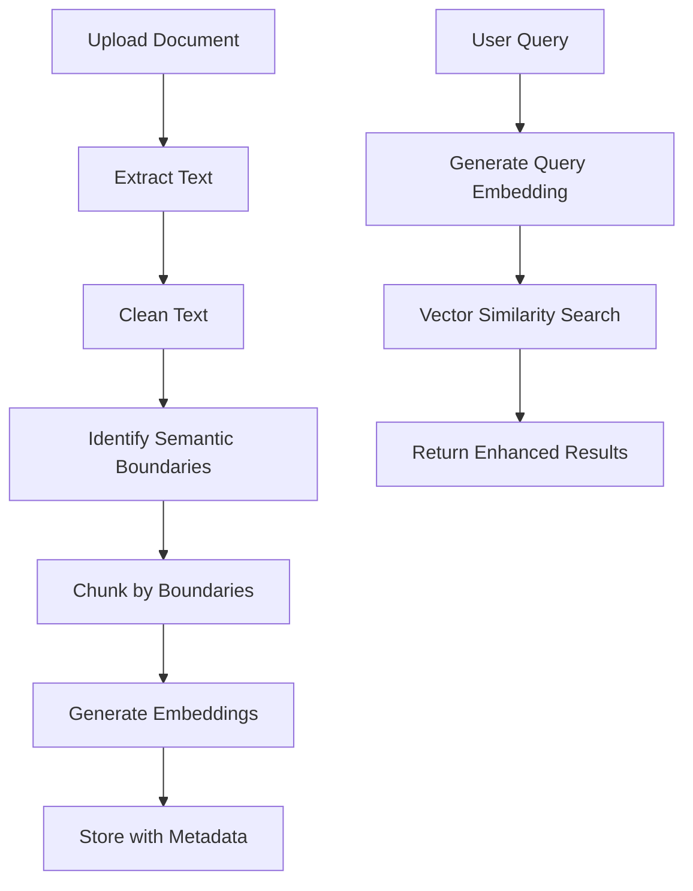

# Enhanced Document Processing System

This document describes the comprehensive improvements made to the document processing and retrieval system, implementing semantic chunking, structured metadata, and enhanced query experience.

## 🎯 Key Improvements

### 1. Semantic Text Extraction
- **Extract only meaningful text**: Strips out boilerplate, references, tables, figures, image captions
- **Remove headers/footers**: Eliminates page numbers, disclaimers, and legal text
- **Focus on content**: Preserves sections, paragraphs, definitions, derivations, and examples

### 2. Semantic Boundary Chunking
- **Chunk by semantic boundaries**: Instead of fixed token sizes, chunks are created at:
  - Section boundaries
  - Subsection boundaries  
  - Paragraph boundaries
  - Slide topics
- **Heading-aware splitting**: Uses markdown headings, numbered sections, and ALL CAPS headings
- **Intelligent overlap**: Maintains context between chunks with smart overlap

### 3. Structured Metadata Storage
Each chunk now includes comprehensive metadata:

| Column | Type | Description | Example |
|--------|------|-------------|---------|
| `chunk_id` | UUID | Unique identifier | auto-generated |
| `user_id` | UUID | Student identifier | user_123 |
| `document_id` | UUID | Source document ID | doc_456 |
| `text` | TEXT | Actual chunk content | "Machine learning is..." |
| `source_type` | ENUM | Document type | `pdf`, `notion`, `txt`, `markdown` |
| `source_link` | TEXT | Direct URL to source | `https://notion.so/page123` |
| `page_number` | INT | PDF page number | 15 |
| `section_title` | TEXT | Section heading | "Introduction to ML" |
| `embedding` | VECTOR(384) | 384-d embedding | [0.1, 0.2, ...] |
| `chunk_size` | INT | Character count | 1250 |
| `created_at` | TIMESTAMP | Creation time | 2024-01-15 10:30:00 |

### 4. Optimized Embeddings
- **384-dimensional embeddings**: Using `all-MiniLM-L6-v2` model
- **Balanced accuracy & cost**: Optimal performance for general text similarity
- **pgvector storage**: Efficient PostgreSQL vector operations
- **Cosine similarity search**: Fast retrieval with proper indexing

### 5. Enhanced Query Experience
When students ask questions, they receive:

#### Rich Search Results
```json
{
  "text": "Machine learning algorithms can be categorized into...",
  "highlighted_text": "Machine learning <mark>algorithms</mark> can be categorized...",
  "source_info": {
    "source_url": "https://notion.so/ml-notes",
    "page_number": 15,
    "section_title": "Introduction to ML",
    "chunk_size": 1250
  },
  "summary": "From Introduction to ML (Page 15)",
  "score": 0.95
}
```

#### Key Features
- **Source links**: Direct links to PDF pages or Notion URLs
- **Highlighted text**: Query terms highlighted with `<mark>` tags
- **Context summaries**: Section titles and page numbers
- **Relevance scoring**: Cosine similarity scores (0-1)

## 🏗️ Architecture

### Document Processing Pipeline



### Database Schema

```sql
CREATE TABLE document_chunks (
    id SERIAL PRIMARY KEY,
    chunk_id TEXT UNIQUE,
    user_id TEXT NOT NULL,
    text TEXT NOT NULL,
    document_metadata TEXT,
    source_type source_type_enum NOT NULL,
    source_id TEXT,
    source_url TEXT,
    source_link TEXT,
    page_number INTEGER,
    section_title TEXT,
    embedding TEXT NOT NULL,
    embedding_vector vector(384),
    chunk_index INTEGER DEFAULT 0,
    chunk_size INTEGER DEFAULT 0,
    created_at TIMESTAMP DEFAULT NOW(),
    updated_at TIMESTAMP DEFAULT NOW()
);

CREATE INDEX idx_embedding_vector ON document_chunks 
USING ivfflat (embedding_vector vector_cosine_ops);
```

## 🚀 Implementation Details

### Text Cleaning Process
1. **Remove page numbers**: `^\s*\d+\s*$`, `Page \d+ of \d+`
2. **Remove headers/footers**: `^(Chapter|Section|Part)\s+\d+`
3. **Remove figure captions**: `^(Figure|Table|Fig\.|Tab\.)\s+\d+`
4. **Remove references**: `\[[\d,\s-]+\]`, `\([A-Za-z]+\s+et\s+al\.?\s*,\s*\d{4}\)`
5. **Remove disclaimers**: Legal text, copyright notices
6. **Clean whitespace**: Multiple newlines, spaces, tabs

### Semantic Boundary Detection
1. **Markdown headings**: `^#{1,6}\s+(.+)$`
2. **ALL CAPS headings**: `^([A-Z][A-Z\s]+)$`
3. **Numbered sections**: `^\d+\.\s+(.+)$`
4. **Subsections**: `^\d+\.\d+\s+(.+)$`
5. **Paragraph breaks**: Double newlines between content

### Chunking Algorithm
```python
def chunk_by_semantic_boundaries(text, max_size=2000, overlap=200):
    boundaries = identify_semantic_boundaries(text)
    chunks = []
    current_chunk = []
    current_size = 0
    
    for line in lines:
        if current_size + line_size > max_size:
            # Save current chunk
            chunks.append(create_chunk(current_chunk))
            # Start new chunk with overlap
            current_chunk = overlap_lines + [line]
        else:
            current_chunk.append(line)
            current_size += line_size
    
    return chunks
```

## 📊 Performance Optimizations

### Database Indexes
- `idx_user_source`: (user_id, source_type)
- `idx_user_created`: (user_id, created_at)
- `idx_source_id`: (source_id)
- `idx_section_title`: (section_title)
- `idx_page_number`: (page_number)
- `idx_embedding_vector`: Vector similarity index

### Embedding Optimizations
- **Model**: `all-MiniLM-L6-v2` (384 dimensions)
- **Batch processing**: Process multiple texts together
- **Fallback handling**: Hash-based embeddings if model fails
- **Caching**: Embeddings stored in database

### Query Optimizations
- **Vector similarity**: Cosine distance with pgvector
- **User filtering**: Scoped to user's documents
- **Result limiting**: Top 5-10 most relevant chunks
- **Metadata preloading**: All source info in single query

## 🔧 Migration

### Database Migration
Run the migration script to update your database schema:

```bash
cd backend
python migrate_to_enhanced_schema.py
```

### Key Migration Steps
1. Add new columns (source_link, page_number, section_title, chunk_size)
2. Create source_type enum
3. Update existing records with default values
4. Enable pgvector extension
5. Create vector column with 384 dimensions
6. Add performance indexes

## 🧪 Testing

### Test Document Processing
```python
from app.services.document_processor import DocumentProcessor

# Test semantic chunking
documents = await DocumentProcessor.process_file("test.pdf", "test.pdf")
for doc in documents:
    print(f"Section: {doc['metadata']['section_title']}")
    print(f"Size: {doc['metadata']['chunk_size']} chars")
    print(f"Text: {doc['page_content'][:100]}...")
```

### Test Enhanced Search
```python
from app.services.postgres_vector_store import search_documents

results = await search_documents(
    query="machine learning algorithms",
    top_k=5,
    filter={"user_id": "user_123"}
)

for result in results:
    print(f"Score: {result['score']}")
    print(f"Source: {result['source_info']['source_url']}")
    print(f"Section: {result['source_info']['section_title']}")
    print(f"Highlighted: {result['highlighted_text'][:200]}...")
```

## 🎨 Frontend Integration

### Enhanced Search Results Display
```javascript
// Display search results with source links
results.forEach(result => {
    const resultElement = document.createElement('div');
    resultElement.innerHTML = `
        <div class="search-result">
            <div class="highlighted-text">${result.highlighted_text}</div>
            <div class="source-info">
                <a href="${result.source_info.source_url}" target="_blank">
                    ${result.summary}
                </a>
                <span class="score">Relevance: ${(result.score * 100).toFixed(1)}%</span>
            </div>
        </div>
    `;
    resultsContainer.appendChild(resultElement);
});
```

### CSS for Highlighting
```css
mark {
    background-color: #ffeb3b;
    padding: 2px 4px;
    border-radius: 3px;
    font-weight: bold;
}

.search-result {
    border: 1px solid #e0e0e0;
    border-radius: 8px;
    padding: 16px;
    margin-bottom: 16px;
    background: white;
}

.source-info {
    margin-top: 8px;
    font-size: 0.9em;
    color: #666;
}
```

## 🚀 Benefits

### For Students
- **Precise source attribution**: Know exactly where information comes from
- **Contextual understanding**: See section titles and page numbers
- **Highlighted results**: Query terms stand out in results
- **Direct access**: Click to view original source

### For System Performance
- **Semantic chunking**: More meaningful embeddings
- **Reduced duplication**: Better chunk boundaries
- **Faster retrieval**: Optimized vector search
- **Structured data**: Rich metadata for filtering and sorting

### For Content Quality
- **Clean text**: No boilerplate or references
- **Focused content**: Only meaningful information
- **Better context**: Section-aware chunking
- **Enhanced UX**: Rich, interactive search results

## 🔮 Future Enhancements

### Planned Improvements
1. **Multi-language support**: Language detection and processing
2. **Advanced chunking**: Topic modeling for better boundaries
3. **Citation extraction**: Automatic reference parsing
4. **Content summarization**: AI-generated chunk summaries
5. **Visual search**: Image and diagram processing
6. **Collaborative filtering**: User interaction-based ranking

### Advanced Features
1. **Semantic search**: Query expansion and synonym matching
2. **Cross-document linking**: Related content across sources
3. **Temporal relevance**: Time-based result ranking
4. **Personalization**: User-specific result ranking
5. **Analytics**: Search pattern analysis and insights

This enhanced document processing system provides a foundation for a truly intelligent knowledge base that understands content structure and provides rich, contextual search results.
